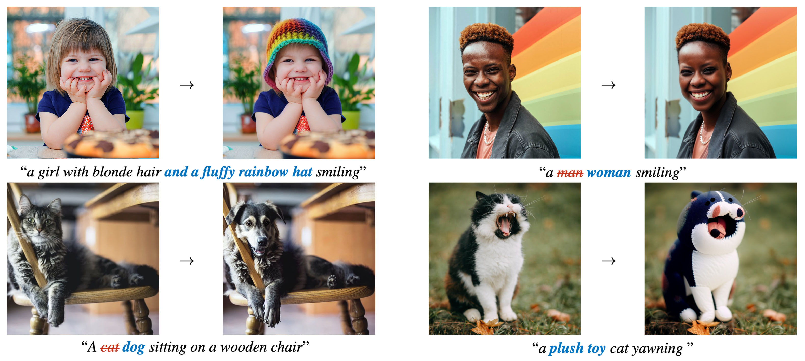
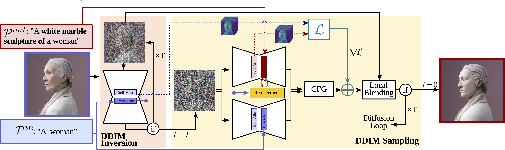
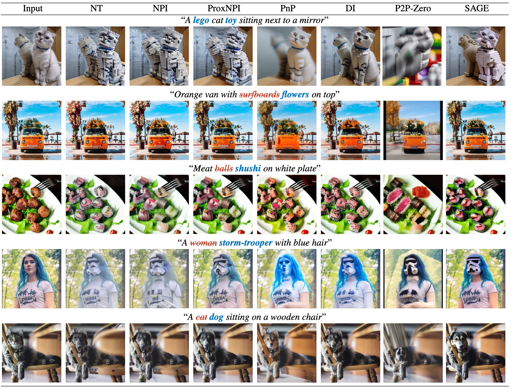
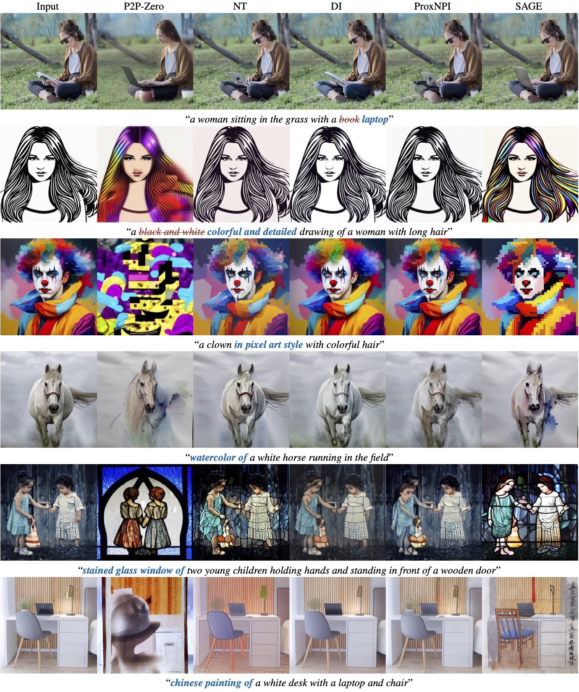
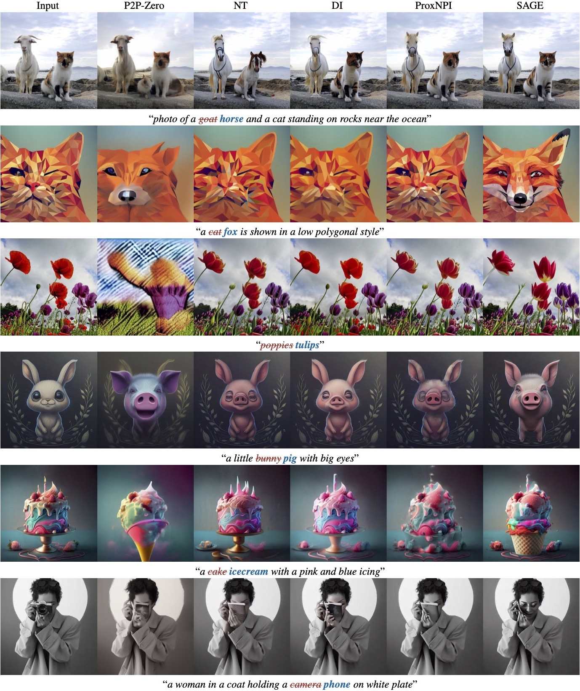

# SAGE: Don't Forget your Inverse DDIM for Image Editing

Source code for the paper "Don't Forget your Inverse DDIM for Image Editing".

> Guillermo Gomez-Trenado<sup>1*</sup>, Pablo Mesejo<sup>1</sup>, Óscar Cordón<sup>1</sup>, Stéphane Lathuilière<sup>2</sup><br>
> <sup>1</sup>DaSCI research institute, DECSAI, University of Granada, Granada, Spain<br>
 <sup>2</sup>LTCI, Telécom-Paris, Intitute Polytechnique de Paris, Palaiseau, France <br>
 <sup>*</sup>Corresponding Author


<p align="center" id="links">
  <a href="https://guillermogotre.github.io/sage/">Project Page</a> |
  <a href="https://arxiv.org/abs/2505.09571">Arxiv</a> |
  <a href="https://github.com/guillermogotre/sage">Code</a> |
  <a href="https://huggingface.co/spaces/guillermogotre/sage">HuggingFace Demo (CPU)</a>
</p>

[](https://colab.research.google.com/github/guillermogotre/sage/blob/main/app_colab.ipynb)



The field of text-to-image generation has undergone significant advancements with the introduction of diffusion models. However, the challenge of editing real images has persisted, with most methods being too computationally intensive or resulting in poor reconstruction. In this paper, we introduce SAGE, a novel technique utilizing pre-trained diffusion models for image editing. The superior performance of SAGE compared to existing approaches is evidenced through both quantitative and qualitative evaluations, complemented by a detailed user study.

**Table of Contents**

- [Method Overview](#method-overview)
- [Getting Started](#getting-started)
    - [Environment Requirement](#environment-requirement)
- [Running Scripts](#running-scripts)
- [Examples](#exaples)
- [Cite Us](#cite-us)

## Method Overview

<span id="method-overview"></span>

SAGE, standing for Self-Attention Guidance for image Editing, builds upon the DDIM algorithm. It incorporates a novel guidance mechanism leveraging the self-attention layers of the diffusion U-Net. This mechanism computes a reconstruction objective by utilizing attention maps generated during the inverse DDIM process. This allows for the efficient reconstruction of unedited regions, eliminating the need for precise reconstruction of the entire input image, thereby addressing the key challenges in image editing.



## Getting started

<span id="getting-started"></span>

There are several ways of use SAGE. 
- HuggingFace Demo: There is an available HF demo. The user should fork it and run it on a GPU environment. We strongly advise the user against running it on CPU.
- Google Colab: Right after the [links](#links) section, there is a Google Colab button that allows you to run SAGE on GPU.
- You own PC: Keep reading for instruction on how to run this code in your own PC.

### Environment requirements

<span id="environment-requirements"></span>

The required packages are described both in ```requirements.txt``` and ```python_versions.txt```. There is an additional file ```conda_environment.yml``` as a testimony of every package version used for the experimentation, many packages are not used in this code and the user should not try to install the ```.yml``` file with conda.

Follow [PyTorch installation instructions](https://pytorch.org/get-started/locally/) and [Diffusers'](https://huggingface.co/docs/diffusers/installation) to install both packages. The rest can be intalled with ```pip```.

There are two system environment variables that can be set on the running computer:

- ```GRADIO_PORT=PORT``` To select the specific port ```PORT``` the Gradio should run on.
- ```SAGE_MEMORY_INTENSIVE=1``` To enable the generation of _Cross-Attention maps history_.

## Running Scripts

<span id="running-scripts"></span>

The main files for running SAGE are in the root path of this repository:

- ```app.py```: Runs the Gradio app on your system.
- ```app_colab.ipynb```: Used only as the source for the Google Colab environment. Can be ignored.
- ```custom_inversion_functional.py```: The function ```run(...)``` runs SAGE method attending to the function's parameters.
- ```run_piebench.py```: Contains the functions to evaluate SAGE on PieBench for a given configuration.
- ```run_piebench_ablation.sh```: Repeat every experiment used in the paper's ablation.

## Examples





## Citation
```
@misc{gomeztrenado2025dontforgetinverseddim,
      title={Don't Forget your Inverse DDIM for Image Editing}, 
      author={Guillermo Gomez-Trenado and Pablo Mesejo and Oscar Cordón and Stéphane Lathuilière},
      year={2025},
      eprint={2505.09571},
      archivePrefix={arXiv},
      primaryClass={cs.CV},
      url={https://arxiv.org/abs/2505.09571}, 
}
```
